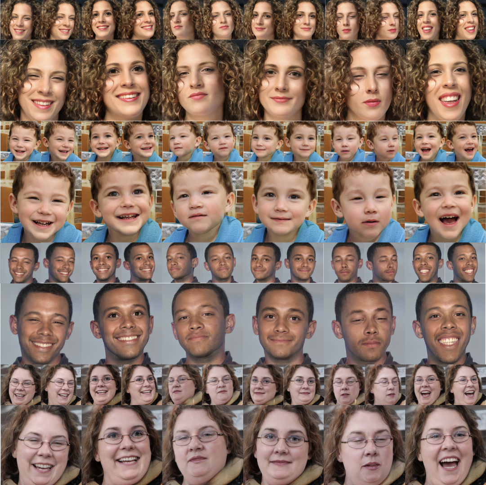

# OmniAvatar: Geometry-Guided Controllable 3D Head Synthesis
### [Project](https://hongyixu37.github.io/omniavatar/)| [Paper](https://arxiv.org/abs/2303.15539) <br>


___

> **OmniAvatar: Geometry-Guided Controllable 3D Head Synthesis**<br>
> Hongyi Xu, Guoxian Song, Zihang Jiang, Jianfeng Zhang, Yichun Shi, Jing Liu, Wanchun Ma, Jiashi Feng, Linjie Luo<br>
> https://arxiv.org/abs/2303.15539 <br>
>
>**Abstract:** We present DeepSIM, a generative model for conditional image manipulation based on a single image.
We present OmniAvatar, a novel geometry-guided 3D head synthesis model trained from in-the-wild unstructured images that is capable of synthesizing diverse identity- preserved 3D heads with compelling dynamic details un- der full disentangled control over camera poses, facial ex- pressions, head shapes, articulated neck and jaw poses. To achieve such high level of disentangled control, we first ex- plicitly define a novel semantic signed distance function (SDF) around a head geometry (FLAME) conditioned on the control parameters. This semantic SDF allows us to build a differentiable volumetric correspondence map from the observation space to a disentangled canonical space from all the control parameters. We then leverage the 3D- aware GAN framework (EG3D) to synthesize detailed shape and appearance of 3D full heads in the canonical space, fol- lowed by a volume rendering step guided by the volumetric correspondence map to output into the observation space. To ensure the control accuracy on the synthesized head shapes and expressions, we introduce a geometry prior loss to conform to head SDF and a control loss to conform to the expression code. Further, we enhance the temporal realism with dynamic details conditioned upon varying expressions and joint poses. Our model can synthesize more preferable identity-preserved 3D heads with compelling dynamic de- tails compared to the state-of-the-art methods both qualita- tively and quantitatively. We also provide an ablation study to justify many of our system design choices.

## Get Started
### Setup 
1.  Clone the repo:
```bash
git clone https://github.com/hongyixu37/omniavatar-proj.git
cd omniavatar-proj
```
2. Create a new environment and install the libraries:
```bash
conda env create -f environment.yml
conda activate omniavatar
```
3. Download our [pretrained model and FLAME fittings to FFHQ dataset](https://drive.google.com/drive/folders/1Q9NYBX_pD8dO-YrCjWHYK53GIrYBIBMK). Save them in the ./pretrained folder.
### Inference
```
python3 gen_grouped_samples.py --network ./pretrained/omniavatar.pkl --outdir results --label-pool ./pretrained/ffhq_labels.npy --trunc 0.7 --cfg ffhq_3dmm --num-groups 5 --num-samples 4
```


## Citation
If you find this useful for your research, please use the following.

```
@InProceedings{Xu_2023_CVPR_OmniAvatar,
    author    = {Xu, Hongyi and Guoxian Song and Zihang Jiang and Jianfeng Zhang and Yichun Shi and Jing Liu and Wanchun Ma and Jiashi Feng and Linjie Luo},
    title     = {OmniAvatar: Geometry-Guided Controllable 3D Head Synthesis},
    booktitle = {Proceedings of the IEEE/CVF Conference on Computer Vision and Pattern Recognition (CVPR)},
    month     = {June},
    year      = {2023},
    pages     = {12814-12824}
}
```
## Acknowledgement
Part of code is borrowed from [EG3D](https://github.com/NVlabs/eg3d).
